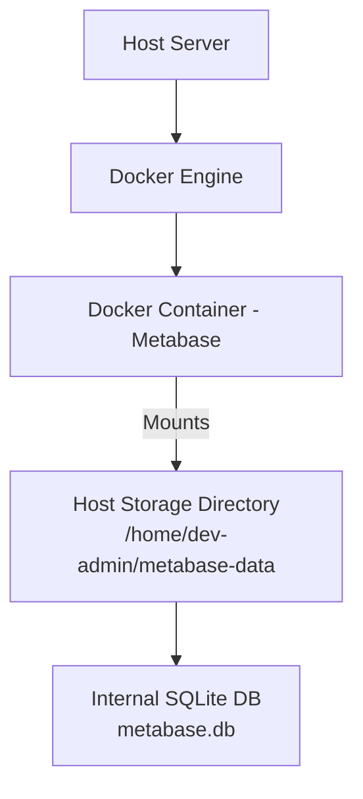
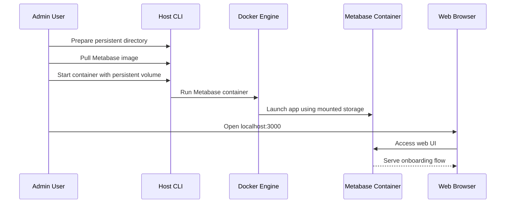

# Metabase Local Deployment Documentation

## Overview

This documentation outlines the step-by-step process for running Metabase locally using Docker with persistent storage. Metabase is a business intelligence tool that enables users to create dashboards, reports, and manage users efficiently. The guide ensures that all data—such as dashboards, reports, and user information—remains safe and available even if the Docker container is stopped, restarted, or deleted.

By following these instructions, developers and administrators can quickly set up a robust, self-contained analytics platform for development, testing, or production use, ensuring data durability across container lifecycles.

---

## Architecture Overview

The architecture consists of a Docker container running the Metabase application, with its internal database stored on the host machine to guarantee data persistence. The container communicates via HTTP/HTTPS, exposing the Metabase web interface on a configurable port.



---

## Setup Steps

### 1. Prerequisites

Before starting, ensure you have the following:

- Docker installed
- Docker CLI access (with permission to run Docker commands)
- Internet connectivity to pull Docker images

Verify Docker installation:

```bash
docker --version
```

Example output:

```bash
Docker version 24.x.x
```

---

### 2. Create a Directory for Persistent Data

Metabase uses an internal database file to store all dashboards, reports, and user information. To ensure persistence, create a directory on the host:

```bash
mkdir -p /home/dev-admin/metabase-data
```

Verify the directory exists:

```bash
ls /home/dev-admin
```

Expected output:

```
metabase-data
```

---

### 3. Pull the Metabase Docker Image

Download the official Metabase Docker image:

```bash
docker pull metabase/metabase
```

Verify the image:

```bash
docker images
```

---

### 4. Run the Metabase Container

Start Metabase with the following command:

```bash
docker run -d \
  -p 3000:3000 \
  -v /home/dev-admin/metabase-data:/metabase-data \
  -e MB_SITE_URL='https://your_domain.com/metabase' \
  -e MB_DB_FILE=/metabase-data/metabase.db \
  --name metabase \
  --restart=always \
  metabase/metabase
```

#### Explanation of Parameters

| Parameter                                       | Purpose                                    |
|-------------------------------------------------|--------------------------------------------|
| `-p 3000:3000`                                  | Exposes Metabase web UI on port 3000       |
| `-v /home/dev-admin/metabase-data:/metabase-data`| Mounts persistent storage                  |
| `MB_SITE_URL`                                   | Public URL for links and embeds            |
| `MB_DB_FILE`                                    | Location of the Metabase internal DB file  |
| `--name metabase`                               | Sets the container name                    |
| `--restart=always`                              | Ensures auto-restart after server reboot   |

---

### 5. Verify Container is Running

Check for the running container:

```bash
docker ps
```

Expected output:

```
CONTAINER ID   IMAGE               PORTS                    ...  
xxxxxxx        metabase/metabase   0.0.0.0:3000->3000/tcp   ...
```

---

### 6. Access Metabase

- **Local Access:** Open [http://localhost:3000](http://localhost:3000) in your browser.
- **Remote Access:** Open `https://your_domain/metabase` in your browser.

#### Initial Onboarding Steps

1. Create an admin account.
2. Connect your database (optional).
3. Finish onboarding.

---

### 7. Data Persistence

All Metabase metadata (dashboards, saved questions, reports, users, permissions, settings) is stored in:

```
/home/dev-admin/metabase-data/metabase.db
```

This ensures your data persists even if you delete or recreate the container.

---

### 8. Useful Docker Commands

| Action                | Command                                 |
|-----------------------|-----------------------------------------|
| View logs             | `docker logs metabase`                  |
| Follow logs           | `docker logs -f metabase`               |
| Stop container        | `docker stop metabase`                  |
| Start container       | `docker start metabase`                 |
| Restart container     | `docker restart metabase`               |
| Remove container      | `docker rm -f metabase`                 |

> **Note:** Removing the container **does not delete** the stored data due to the mounted volume (`/home/dev-admin/metabase-data`).

---

### 9. Recreate Container (If Needed)

If the container is removed or needs to be recreated, simply run the `docker run` command again. Metabase will automatically load the existing database file from the persistent storage.

```bash
docker run -d \
  -p 3000:3000 \
  -v /home/dev-admin/metabase-data:/metabase-data \
  -e MB_SITE_URL='https://api-admin-release.byotautoparts.com/metabase' \
  -e MB_DB_FILE=/metabase-data/metabase.db \
  --name metabase \
  --restart=always \
  metabase/metabase
```

---

### 10. Backup Recommendation

Regularly backup the persistent data directory to ensure dashboards and reports can be restored if needed:

```bash
tar -czvf metabase-backup.tar.gz /home/dev-admin/metabase-data
```

---

### 11. Troubleshooting

#### Container Not Starting

Check logs:

```bash
docker logs metabase
```

#### Port Already in Use

Check which services are using the port:

```bash
sudo lsof -i :3000
```

Then, stop the conflicting service or change the port mapping for Metabase.

---

## Component Structure

### Docker Container & Host Storage

| Component      | Description                                           |
|----------------|------------------------------------------------------|
| Docker Engine  | Runs and manages the Metabase container              |
| Metabase Image | Official Metabase app packaged for Docker            |
| Host Volume    | Directory on host mapped to container for persistence|

---

## Data Model

### Metabase Internal Database

| File                              | Description                          |
|------------------------------------|--------------------------------------|
| `/metabase-data/metabase.db`       | SQLite DB used for Metabase metadata |

Stores:

- Dashboards
- Saved questions
- Reports
- Users
- Permissions
- Settings

---

## Feature Flows

### Initial Setup & Access



---

## Key Classes Reference

| Component          | Location                          | Responsibility                                       |
|--------------------|-----------------------------------|------------------------------------------------------|
| Metabase Container | Docker (metabase/metabase image)  | Runs Metabase web app, exposes port, manages DB file |
| Host Storage       | /home/dev-admin/metabase-data     | Stores persistent Metabase database                  |

---

## Error Handling

- If the container fails to start, use `docker logs metabase` to view error output.
- If the expected port is already used, check with `sudo lsof -i :3000` and resolve conflicts.

---

## Caching Strategy

- All Metabase metadata is stored in the persistent DB file, so cached dashboards and queries survive container restarts.
- No additional cache configuration is present in this guide.

---

## Dependencies

- Docker (version 24.x.x or compatible)
- Official Metabase Docker image (pulled from Docker Hub)
- Host system with directory `/home/dev-admin/metabase-data` for storage

---

## Testing Considerations

- After setup, verify that you can create dashboards and reports, then restart or remove the container and confirm data persists.
- Test accessing Metabase via the browser at the configured port.
- Use the backup and restore commands to confirm data safety.

---

---

## Important Note

```card
{
  "title": "Data Persistence Guarantee",
  "content": "All dashboards, reports, and user information are safe from container deletion, provided you use the persistent host directory."
}
```

---

## Quick Reference: Accessing Metabase

- Local: `http://localhost:3000`
- Remote: `https://your_domain/metabase` (with correct site URL)

---

# End of Documentation
